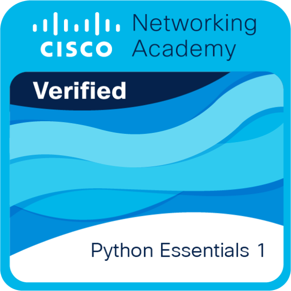
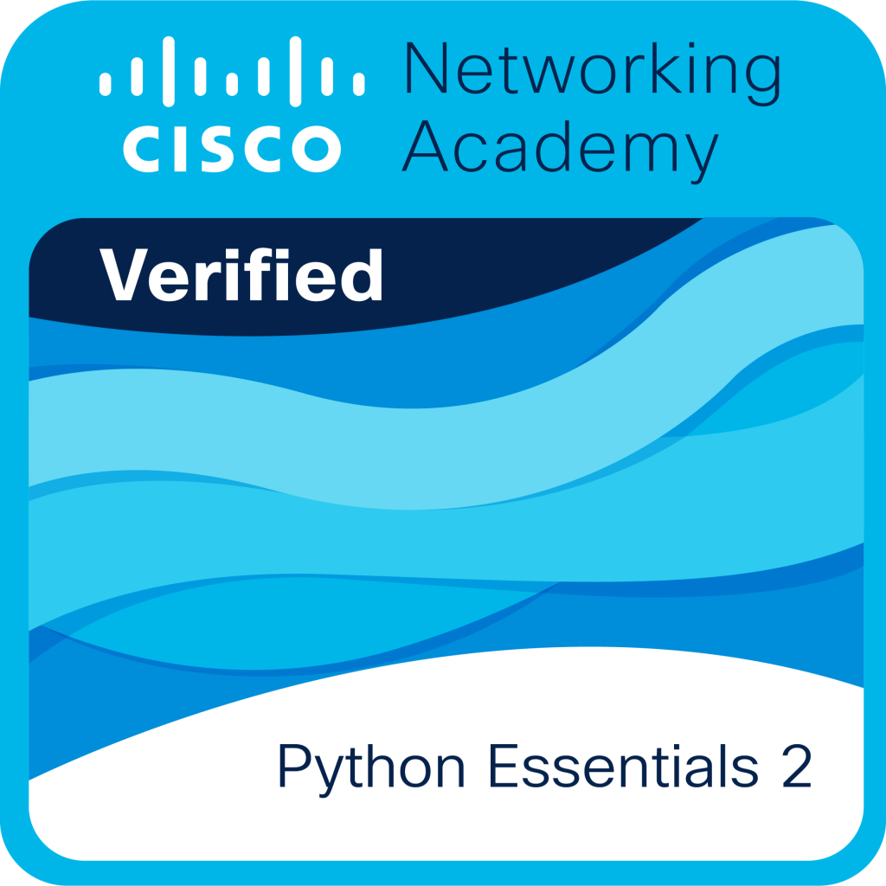

<h1 align="center">Hi, I'm Abdulaziz</h1>

<h3 align="center">
Computer & Network Engineering Student
</h3>

<p align="center">

</p>

<p align="center">
  <a href="https://www.linkedin.com/in/abdulaziz-mashnawi-726a68275">
    
  </a>
  <a href="mailto:abdulazizmashnawi@gmail.com">
    
  </a>
</p>

<br>

## About Me

```console
[abdulaziz@linux ~]$ cat about_me.txt
> Computer & Network Engineering Student
> Deeply interested in Networking & Linux
> Currently studying and preparing for CCNA
> Enthusiastic about AI & Automation
```

<br>

## Certifications & Goals

**Obtained Certifications:**
<p>
  
  
</p>

**In Progress / Goals:**
<p>
  
  
</p>

<br>

## Skills Proficiency

<div align="center">
  
</div>

<br>

## Tech Stack

### Languages & Development
<p>

</p>

### Systems, Tools & DevOps
<p>

</p>

<br>

## Top Languages

<div align="center">
  
</div>

<br>

## Pinned Repositories

<div align="center">
  <a href="https://github.com/AbdulazizMashnawi-NET/Smart-University-Network-Design">
    
  </a>
  <a href="https://github.com/AbdulazizMashnawi-NET/Jazan-Uni-SUC-Manager">
    
  </a>
   </a>
  <a href="https://github.com/AbdulazizMashnawi-NET/SecureChat-E2EE-Simulator">
    
  </a>
</div>

<br>

## Contribution Graph

<div align="center">
  <picture>
    <source media="(prefers-color-scheme: dark)" srcset="https://raw.githubusercontent.com/AbdulazizMashnawi-NET/AbdulazizMashnawi-NET/output/github-contribution-grid-snake-dark.svg">
    <source media="(prefers-color-scheme: light)" srcset="https://raw.githubusercontent.com/AbdulazizMashnawi-NET/AbdulazizMashnawi-NET/output/github-contribution-grid-snake.svg">
    
  </picture>
</div>

<br>

<div align="center">
  
</div>

<p align="center">
Thanks for visiting my profile!
</p>
