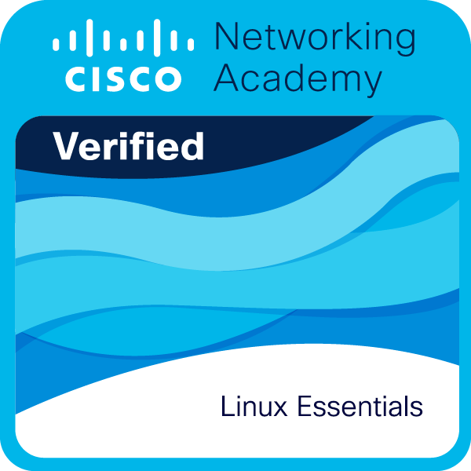

<h1 align="center">Hi, I'm Abdulaziz</h1>

<h3 align="center">
Computer & Network Engineering Student @ Jazan University
</h3>

<p align="center">

</p>

<p align="center">
  <a href="https://www.linkedin.com/in/abdulaziz-mashnawi-726a68275">
    
  </a>
  <a href="mailto:abdulazizmashnawi@gmail.com">
    
  </a>
  
</p>

<br>

## About Me

```console
[abdulaziz@linux ~]$ cat about_me.txt
> Role: B.S. in Computer & Network Engineering @ Jazan University
> Specialization: Network Architecture, Automation, Linux Administration & Cryptography
> Core Focus: High-Availability (HA) 3-Tier Enterprise Networks, E2EE Protocols, RDBMS Lifecycle
> Target Credentials: Cisco CCNA (200-301), AWS Solutions Architect, Cisco DevNet
> Professional Membership: Saudi Council of Engineers (SCE) - Student Member
```

<br>

## Core Engineering Domains

<table>
  <tr>
    <td width="50%" valign="top">
      <h3>🌐 Network Architecture & Protocols</h3>
      <ul>
        <li><b>3-Tier Hierarchical Design:</b> Core, Distribution, Access Layers</li>
        <li><b>Routing & Switching:</b> Layer 3 Switching, VLAN Segmentation, Packet Switching</li>
        <li><b>Resilience:</b> High Availability (HA) & Redundancy Planning</li>
        <li><b>Simulation:</b> Cisco Packet Tracer & Network Topologies</li>
      </ul>
    </td>
    <td width="50%" valign="top">
      <h3>🔐 Security & Cryptography</h3>
      <ul>
        <li><b>Encryption Protocols:</b> End-to-End Encryption (E2EE) Handshakes</li>
        <li><b>Ciphers & Keys:</b> Public Key Cryptography (RSA), AES-GCM</li>
        <li><b>Attack Simulation:</b> Man-in-the-Middle (MitM) Threat Vectors</li>
        <li><b>Network Security:</b> Access Control, Traffic Hardening</li>
      </ul>
    </td>
  </tr>
  <tr>
    <td width="50%" valign="top">
      <h3>🐧 Linux Systems & Automation</h3>
      <ul>
        <li><b>GNU/Linux OS:</b> System Administration, Components, Permissions</li>
        <li><b>Shell Scripting:</b> Bash Automation, File & Backup Management</li>
        <li><b>Python Engineering:</b> OOP (Inheritance, Polymorphism), Generators, PIP</li>
        <li><b>DevOps & Tooling:</b> Git, GitHub, Docker, Postman</li>
      </ul>
    </td>
    <td width="50%" valign="top">
      <h3>🗄️ Database & Application Design</h3>
      <ul>
        <li><b>RDBMS Lifecycle:</b> E-R Modeling, Relational Mapping, Schema Design</li>
        <li><b>SQL Implementation:</b> DDL, DML, Complex Queries, Oracle DB</li>
        <li><b>Web Utilities:</b> Client-Side UI, Conflict-Free Schedule Optimization</li>
        <li><b>Emerging Tech:</b> Internet of Things (IoT), Cloud Fundamentals</li>
      </ul>
    </td>
  </tr>
</table>

<br>

## Certifications & Credentials

**Verified Badges:**
<p align="left">
  
  &nbsp;
  
  &nbsp;
  
</p>

**Professional Affiliations & Targets:**
<p align="left">
  
  &nbsp;
  
  &nbsp;
  
  &nbsp;
  
</p>


## Tech Stack

### Languages & Databases
<p>

</p>

### Systems, Networking & Cloud
<p>

</p>

<br>

## Featured Projects

<div align="center">
  <a href="https://github.com/AbdulazizMashnawi-NET/Smart-University-Network-Design">
    
  </a>
  <a href="https://github.com/AbdulazizMashnawi-NET/SecureChat-E2EE-Simulator">
    
  </a>
</div>
<br>
<div align="center">
  <a href="https://github.com/AbdulazizMashnawi-NET/Jazan-Uni-SUC-Manager">
    
  </a>
  <a href="https://github.com/AbdulazizMashnawi-NET/Shipping-Company-Database">
    
  </a>
</div>

<br>

## Top Languages

<div align="center">
  
</div>

<br>

## Contribution Graph

<div align="center">
  <picture>
    <source media="(prefers-color-scheme: dark)" srcset="https://raw.githubusercontent.com/AbdulazizMashnawi-NET/AbdulazizMashnawi-NET/output/github-contribution-grid-snake-dark.svg">
    <source media="(prefers-color-scheme: light)" srcset="https://raw.githubusercontent.com/AbdulazizMashnawi-NET/AbdulazizMashnawi-NET/output/github-contribution-grid-snake.svg">
    
  </picture>
</div>

<br>

<div align="center">
  
</div>

<p align="center">
⭐ Thanks for visiting my profile!
</p>
